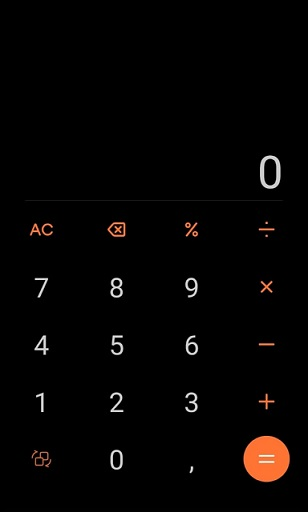
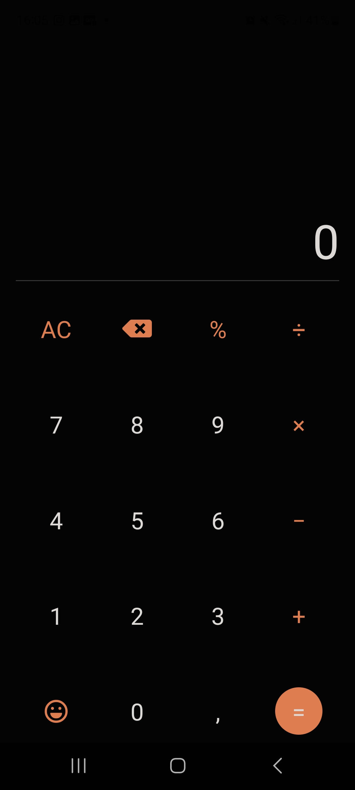

# simple-calc

## Sumário

- [simple-calc](#simple-calc)
  - [Sumário](#sumário)
  - [Motivação](#motivação)
  - [Pilha de tecnologia](#pilha-de-tecnologia)
  - [Galeria](#galeria)
    - [Protótipo visual fornecido pelo professor](#protótipo-visual-fornecido-pelo-professor)
    - [Tela desenvolvida](#tela-desenvolvida)
  - [Como rodar](#como-rodar)
    - [Pré-requisitos](#pré-requisitos)
    - [Passo a passo](#passo-a-passo)

## Motivação

Este app consiste em uma calculadora.

Por estarmos em um ambiente de experimentação, as operações aritméticas são efetuadas através da função [`eval`](https://developer.mozilla.org/pt-BR/docs/Web/JavaScript/Reference/Global_Objects/eval). Entretanto, o professor alertou sobre as potenciais vulnerabilidades de tal função em ambientes profissionais. Vale destacar que toda a lógica do app foi desenvolvida pelo professor em sala de aula e a atividade consistiu em finalizar o app, adicionando apenas a interface de usuário.

Este foi o primeiro repositório de código apresentado no [Curso Superior de TSI](https://www.ifms.edu.br/campi/campus-aquidauana/cursos/graduacao/sistemas-para-internet/sistemas-para-internet) do IFMS como requisito para obtenção da nota parcial das atividades da unidade curricular Programação para Dispositivos Móveis I.

| [Próximo repositório &rarr;](https://github.com/mdccg/minesweeper-mobile) |
|-|

## Pilha de tecnologia

| Papel | Tecnologia |
|-|-|
| Ambiente de execução | [Node](https://nodejs.org/en/) |
| Plataforma | [Expo](https://expo.dev/) | 
| Linguagem de programação | [JavaScript](https://developer.mozilla.org/pt-BR/docs/Web/JavaScript) |
| Front-end | [React Native](https://reactnative.dev/) |

## Galeria

### Protótipo visual fornecido pelo professor



### Tela desenvolvida



## Como rodar

### Pré-requisitos

- [Node](https://nodejs.org/en/download/);
- [Yarn](https://yarnpkg.com/) (opcional);
- Dispositivo móvel:
  - [Expo Go](https://expo.dev/client).

### Passo a passo

1. Clone o repositório de código em sua máquina;
   
2. Abra um shell de comando de sua preferência (prompt de comando, PowerShell, terminal _etc_.);
   
3. Instale as dependências do projeto através do seguinte comando:

```console
$ npm install
```

Caso esteja utilizando o gerenciador de pacotes Yarn, execute o seguinte comando como alternativa:

```console
$ yarn
```

4. Execute o seguinte comando para iniciar o app:

Para npm:

```console
$ npm run start
```

Para Yarn:

```console
$ yarn start
```

5. Uma vez iniciado, aparecerá um QR Code. Você deve escaneá-lo com o aplicativo [Expo Go](https://expo.dev/client), disponível para Android e iOS;

6. Como alternativa, você pode executar o app no seu navegador, pressionando o atalho `w`. Entretanto, alguns módulos podem não funcionar na versão web do app;

7. Exclusivamente para este repositório de código, você pode executar uma versão similar no meu _snack_[<sup>1</sup>](#nota-de-rodape-1) [mdccg/calculadora2](https://snack.expo.dev/@mdccg/calculadora2).

<sup id="nota-de-rodape-1">1</sup> _Snack_ refere-se a um recurso do site da Expo onde os desenvolvedores podem criar, visualizar e compartilhar trechos de código-fonte em tempo real usando um ambiente de desenvolvimento on-line. Esses trechos de código-fonte geralmente contêm exemplos de como implementar recursos específicos no React Native, e os usuários podem testá-los instantaneamente em seus próprios dispositivos móveis, sem precisar configurar um ambiente de desenvolvimento em seu computador.
